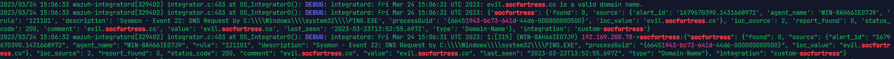
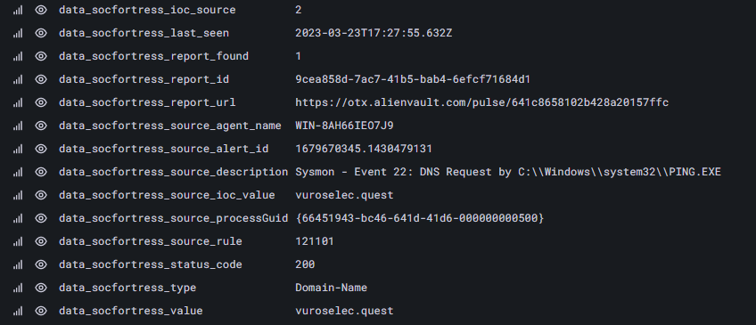
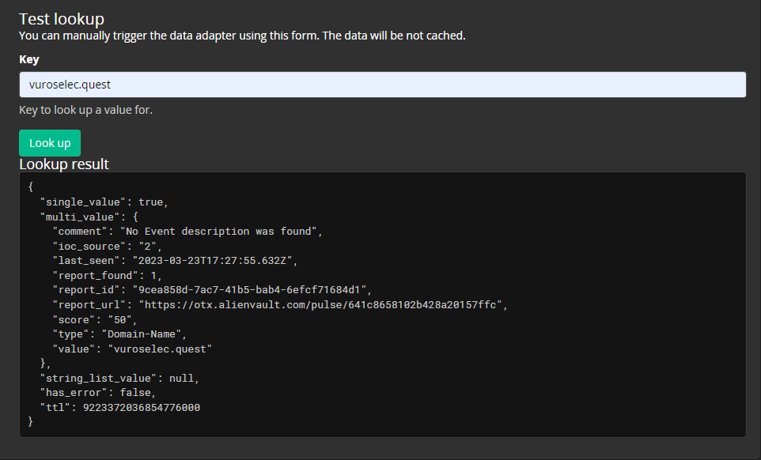

[](https://www.socfortress.co/)

# SOCFortress Threat Intel Integration [](https://www.socfortress.co/trial.html)
> Integrate your `Wazuh-Manager` or `Graylog` with the SOCFortress Threat Intel API to receive real-time threat intel.


[![MIT License][license-shield]][license-url]
[![LinkedIn][linkedin-shield]][linkedin-url]
[](https://youtu.be/2EMb6zYx7_E)

<!-- PROJECT LOGO -->
<br />
<div align="center" width="50" height="50">
  <a href="https://www.socfortress.co/">
    
  </a>

  <h3 align="center">SOCFortress Threat Intel API</h3>

  <p align="center">
    <a href="https://paypal.me/socfortress?country.x=US&locale.x=en_US"><strong>💰 Make a Donation »</strong></a>
    <br />
    <br />
  </p>
</div>

<!-- TABLE OF CONTENTS -->
<details>
  <summary>Table of Contents</summary>
  <ol>
    <li>
      <a href="#threat-intel=api">Threat Intel API</a>
    </li>
    <li>
      <a href="#wazuh-manager-integration">Wazuh-Manager Integration</a>
    </li>
    <li>
    <a href="#graylog-integration">Graylog Integration</a>
    </li>
  </ol>
</details>


<!-- Threat Intel API-->
# Threat Intel API
> The SOCFortress Threat Intel API allows end users to consume SOCFortress's public threat intel. The integration supports both `Wazuh-Manager` and `Graylog`. 

## API-KEY
> The API key is required to authenticate with the API. To obtain an API key, please fill out a request form at [SOCFortress.co](https://www.socfortress.co/request_threat_intel_api.html).

## Criteria
> The API is currently **only** built for the following criteria:
* `Windows Sysmon` - Follow our [Wazuh Agent Install Guide](https://medium.com/@socfortress/part-4-wazuh-agent-install-endpoint-monitoring-f24f6a0464ac) to integrate Sysmon with your Windows endpoints.
* `SOCFortress Wazuh Detection Rules` - Follow our [Wazuh Rules Install Guide](https://github.com/socfortress/Wazuh-Rules) to integrate SOCFortress's Wazuh detection rules with your Wazuh-Manager.
* `IoC Type` - The API currently supports IoC types of `IP`, `Domain`, and `SHA256 Hash`.
* `Valid API Key` - Request via [our website](https://www.socfortress.co/request_threat_intel_api.html).

> ⚠ **NOTE:** API quotas are currently restricted to `500` requests per day. The API is currently in beta and is subject to change. Please contact us at [helpdesk.socfortress.co](https://servicedesk.socfortress.co/help/2979687893) if you have any questions or concerns.

* `SOCFortress API Wazuh Rules` - [200980-socfortress.xml](https://raw.githubusercontent.com/socfortress/Wazuh-Rules/main/SOCFortress%20API/200980-socfortress.xml) - **NOT REQUIRED IF INTEGRATING WITH GRAYLOG**

<!-- Wazuh-Manager Integration -->
# Wazuh-Manager Integration
**Not Recommended - Use Graylog Instead If You Can - Graylog's built in Caching will save your API quota**
> Follow the steps below to integrate the SOCFortress Threat Intel API with your Wazuh-Manager. **NOT REQUIRED IF INTEGRATING WITH GRAYLOG**
1. Download the `custom-socfortress.py` file from the GitHub repository and copy it to `/var/ossec/integrations` of your `Wazuh-Manager`.

```
# Download the custom-socfortress.py file from the GitHub repository
curl -o custom-socfortress.py https://raw.githubusercontent.com/socfortress/SOCFortress-Threat-Intel/main/custom-socfortress.py

# Copy the custom-socfortress.py file to /var/ossec/integrations
sudo cp custom-socfortress.py /var/ossec/integrations

# Change ownership to root:wazuh
sudo chown root:wazuh /var/ossec/integrations/custom-socfortress.py

# Set permissions to -rwxr-x---
sudo chmod 750 /var/ossec/integrations/custom-socfortress.py

# Clean up the downloaded file
rm custom-socfortress.py
```

2. Edit the `/var/ossec/etc/ossec.conf` file and add the following lines to the `ossec.conf` file.

```
<integration>
    <name>custom-socfortress.py</name>
    <api_key>YOUR_API_KEY</api_key>
    <group>sysmon_event3,sysmon_event_22</group>
    <alert_format>json</alert_format>
 </integration>
```
> ⚠ **NOTE:** The `group` parameter is the name of the Wazuh rule groups that you want to integrate with the SOCFortress Threat Intel API. All of the below rule groups are supported: 
* `sysmon_event3` - Network Connections
* `sysmon_event_22` - DNS Query
* `sysmon_evnt1` - Process Creation
* `sysmon_event6` - Remote Thread Creation
* `sysmon_event7` - Raw Access Read
* `sysmon_event_15` - File Creation Time

**I only include the `sysmon_event3` and `sysmon_event_22` groups in the example above because the others will likely result in you hitting your API Limit quickly**


> The `alert_format` parameter is the format of the alert that you want to receive from the SOCFortress Threat Intel API. The `api_key` parameter is the API key that you received from SOCFortress.

3. Restart the Wazuh-Manager service.

```
sudo systemctl restart wazuh-manager
```

4. If you have any issues, set the `integrator_debug` to `2` in the `/var/ossec/etc/local_internal_options.conf` file and restart the Wazuh-Manager service.

    * Tail the `ossec.log` file and ensure you see valid responses from the SOCFortress Threat Intel API. `tail -f /var/ossec/logs/ossec.log | grep socfortress`

<div align="center" width="50" height="50">
  <a href="https://raw.githubusercontent.com/socfortress/SOCFortress-Threat-Intel/main/images/ossec_log.PNG">
    
  </a>

  <h3 align="center">Ossec.log File</h3>
  </p>
</div>

If working correctly, rule id `200983` will trigger when a positive IoC is found.

<div align="center" width="50" height="50">
  <a href="https://github.com/socfortress/SOCFortress-Threat-Intel/images/ossec_log.png">
    
  </a>

  <h3 align="center">SOCFortress Threat Intel Fields</h3>
  </p>
</div>


<!-- Graylog Integration -->
# Graylog Integration
> Follow the steps below to integrate the SOCFortress Threat Intel API with your Graylog instance.
1. Create `SOCFortress Threat Intel` Data Adapter.
* `Title` - SOCFortress Threat Intel
* `Description` - SOCFortress Threat Intel
* `Name` - socfortress-threat-intel
* `Lookup URL` - https://intel.socfortress.co/search?value=${key}
* `Single value JSONPath` - $.success
* `Multi value JSONPath` - $.data
* `HTTP Headers`-
    * `Content-Type` - application/json
    * `module-version` - 1.0
    * `x-api-key` - YOUR_API_KEY

> ⚠ **NOTE:** Verify connection to the SOCFortress Threat Intel API.

<div align="center" width="50" height="50">
  <a href="https://github.com/socfortress/SOCFortress-Threat-Intel/images/graylog_response.png">
    
  </a>

  <h3 align="center">Graylog Response</h3>
  </p>
</div>

2. Create `SOCFortress Threat Intel` Cache.
* `Cache Type` - Node-local, in-memory cache
* `Title` - SOCFortress Threat Intel Cache
* `Description` - SOCFortress Threat Intel Cache
* `Name` - socfortress-threat-intel-cache
* `Maximum Entries` - 1000
* `Expire after access` - 1 hour
3. Create `SOCFortress Threat Intel` Lookup Table.
* `Title` - SOCFortress Threat Intel Lookup Table
* `Description` - SOCFortress Threat Intel Lookup Table
* `Name` - socfortress_threat_intel
* `Data Adapter` - SOCFortress Threat Intel
* `Cache` - SOCFortress Threat Intel Cache
4. Create Pipeline Rules to invoke the SOCFortress Threat Intel Lookup Table.
    1. Sysmon Event 3 - Network Connections
    ```
    rule "WINDOWS SYSMON EVENT 3 - SOCFortress THREAT INTEL"
    when
        $message.rule_group1 == "windows" AND $message.rule_group3 == "sysmon_event3" AND $message.data_win_eventdata_destinationIp != "127.0.0.1" AND $message.data_win_eventdata_destinationIp != "255.255.255.255" AND $message.data_win_eventdata_destinationIp != "0.0.0.0" AND $message.data_win_eventdata_destinationIsIpv6 == "false" AND ! in_private_net(to_string($message.data_win_eventdata_destinationIp))
    then
        let ldata = lookup(
            lookup_table: "socfortress_threat_intel",
            key: to_string($message.data_win_eventdata_destinationIp)
        );
        set_fields(
            fields: ldata,
            prefix: "socfortress_"
            );
    end
    ```
    2. Sysmon Event 22 - DNS Query
    ```
    rule "WINDOWS SYSMON EVENT 22 - SOCFortress THREAT INTEL"
    when
        $message.rule_group1 == "windows" AND $message.rule_group3 == "sysmon_event_22"
    then
        let ldata = lookup(
            lookup_table: "socfortress_threat_intel",
            key: to_string($message.data_win_eventdata_queryName)
        );
        set_fields(
            fields: ldata,
            prefix: "socfortress_"
            );
    end
    ```
> **NOTE:** I'll leave the other rule groups for you to create 😉

<br />

<!-- CONTACT -->
# Contact

SOCFortress - [![LinkedIn][linkedin-shield]][linkedin-url] - info@socfortress.co

<div align="center">
  <h2 align="center">Let SOCFortress Take Your Open Source SIEM to the Next Level</h3>
  <a href="https://www.socfortress.co/contact_form.html">
    
  </a>


</div>


<!-- MARKDOWN LINKS & IMAGES -->
<!-- https://www.markdownguide.org/basic-syntax/#reference-style-links -->
[contributors-shield]: https://img.shields.io/github/contributors/socfortress/Wazuh-Rules
[contributors-url]: https://github.com/socfortress/Wazuh-Rules/graphs/contributors
[forks-shield]: https://img.shields.io/github/forks/socfortress/Wazuh-Rules
[forks-url]: https://github.com/socfortress/Wazuh-Rules/network/members
[stars-shield]: https://img.shields.io/github/stars/socfortress/Wazuh-Rules
[stars-url]: https://github.com/socfortress/Wazuh-Rules/stargazers
[issues-shield]: https://img.shields.io/github/issues/othneildrew/Best-README-Template.svg?style=for-the-badge
[issues-url]: https://github.com/othneildrew/Best-README-Template/issues
[license-shield]: https://img.shields.io/badge/Help%20Desk-Help%20Desk-blue
[license-url]: https://servicedesk.socfortress.co/help/2979687893
[linkedin-shield]: https://img.shields.io/badge/Visit%20Us-www.socfortress.co-orange
[linkedin-url]: https://www.socfortress.co/
